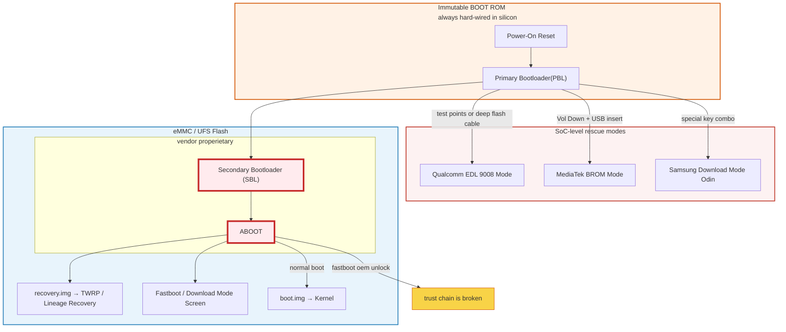

# bootchain 

```mermaid
---
config:
  flowchart:
    subGraphTitleMargin:
      bottom: 30
---
flowchart TD
    subgraph Silicon [Immutable BOOT ROM <br> always hard-wired in silicon

]
        A[Power-On Reset] --> B["Primary Bootloader(PBL)"]
    end

    subgraph Flash ["eMMC / UFS Flash"]
        Par
        E[recovery.img → TWRP / Lineage Recovery]
        F[Fastboot / Download Mode Screen]
        D[boot.img → Kernel]
    end

    subgraph Rescue ["SoC-level rescue modes"]
        B -->|test points or deep flash cable| G[Qualcomm EDL 9008 Mode]
        B -->|Vol Down + USB insert| H[MediaTek BROM Mode]
        B -->|special key combo| I[Samsung Download Mode Odin]
    end

    subgraph Par["vendor properietary"]
        B --> C["Secondary Bootloader (SBL)"]
        C --> J["ABOOT"]
        J -->|normal boot| D
        J --> E
        J --> F
    end

    style Silicon fill:#fff2e6,stroke:#d35400,stroke-width:2px
    style Flash fill:#e8f4fc,stroke:#2980b9,stroke-width:2px
    style Rescue fill:#fdf2f2,stroke:#c0392b,stroke-width:2px
    style C fill:#ffebee,stroke:#c62828,stroke-width:4px
    style J fill:#ffebee,stroke:#c62828,stroke-width:4px
    classDef note fill:#f8d347,stroke:#d35400,stoke-width:5px
    note1["trust chain is broken"]:::note
    J -->|"fastboot oem unlock"| note1
```
