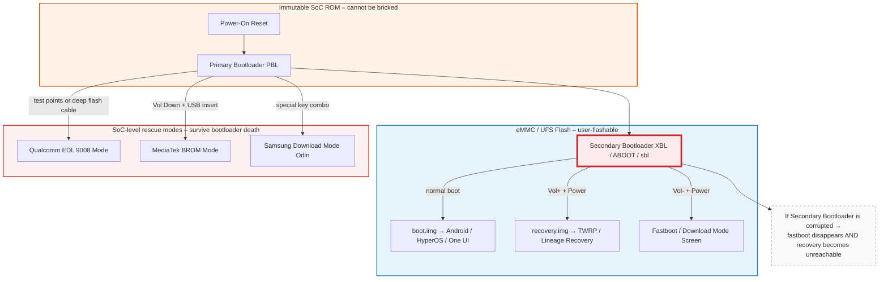

# bootchain 

```mermaid
flowchart TD
    subgraph Silicon ["Immutable SoC ROM – cannot be bricked"]
        A[Power-On Reset] --> B[Primary Bootloader PBL]
    end

    subgraph Flash ["eMMC / UFS Flash – user-flashable"]
        B --> C[Secondary Bootloader XBL / ABOOT / sbl]
        C -->|normal boot| D[boot.img → Android / HyperOS / One UI]
        C -->|Vol+ + Power| E[recovery.img → TWRP / Lineage Recovery]
        C -->|Vol- + Power| F[Fastboot / Download Mode Screen]
    end

    subgraph Rescue ["SoC-level rescue modes – survive bootloader death"]
        B -->|test points or deep flash cable| G[Qualcomm EDL 9008 Mode]
        B -->|Vol Down + USB insert| H[MediaTek BROM Mode]
        B -->|special key combo| I[Samsung Download Mode Odin]
    end

    style Silicon fill:#fff2e6,stroke:#d35400,stroke-width:2px
    style Flash fill:#e8f4fc,stroke:#2980b9,stroke-width:2px
    style Rescue fill:#fdf2f2,stroke:#c0392b,stroke-width:2px
    style C fill:#ffebee,stroke:#c62828,stroke-width:4px

    classDef note fill:#f9f9f9,stroke:#999,stroke-dasharray: 5 5
    note1["If Secondary Bootloader is corrupted →\nfastboot disappears AND recovery becomes unreachable"]:::note
    C --> note1
```
